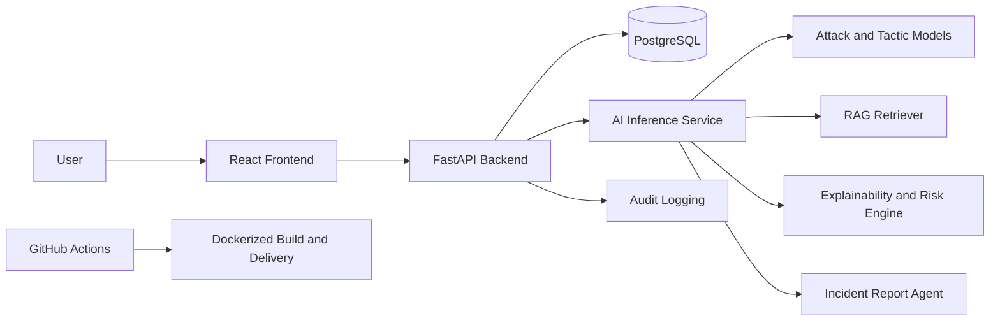

# SEER-AI++ Full-Stack Platform

SEER-AI++ is now a full-stack cybersecurity platform for detecting and investigating social-engineering attacks. The repository keeps the original AI core and refactors the application around it with a FastAPI backend, React + Vite + Tailwind frontend, PostgreSQL, SQLAlchemy, Alembic, Docker, and GitHub Actions.

## Features

- JWT-based authentication
- protected REST API
- PostgreSQL persistence for users, analyses, triggered rules, retrieved chunks, incident reports, and audit logs
- React dashboard for analysis submission and investigation history
- reusable AI orchestration layer around the existing `src` pipeline
- Dockerized local environment
- GitHub Actions for backend, frontend, and Docker checks

## Architecture



## Folder Structure

```text
seer_ai_pp/
├── backend/
│   ├── app/
│   │   ├── main.py
│   │   ├── core/
│   │   ├── models/
│   │   ├── schemas/
│   │   ├── controllers/
│   │   ├── services/
│   │   ├── repositories/
│   │   ├── ai/
│   │   └── utils/
│   ├── alembic/
│   ├── tests/
│   ├── requirements.txt
│   ├── Dockerfile
│   └── .env.example
├── frontend/
│   ├── src/
│   ├── package.json
│   ├── Dockerfile
│   └── .env.example
├── src/
├── outputs/
├── uploads/
├── docker-compose.yml
└── .github/workflows/
```

## Reused AI Modules

The original prototype logic is still reused from:

- `src/risk_engine.py`
- `src/explainability.py`
- `src/rag/*`
- `src/agents/*`

The new backend wraps them through:

- [backend/app/ai/inference_pipeline.py](/Users/mostafaabdelraheem/Documents/New project/seer_ai_pp/backend/app/ai/inference_pipeline.py)

## Backend API Summary

Auth:

- `POST /api/auth/register`
- `POST /api/auth/login`
- `GET /api/auth/me`

Analysis:

- `POST /api/analysis`
- `GET /api/analysis/{id}`
- `GET /api/analysis/history`
- `DELETE /api/analysis/{id}`

Reports:

- `POST /api/reports/{analysis_id}`
- `GET /api/reports/{id}`

Dashboard:

- `GET /api/dashboard/overview`
- `GET /api/dashboard/risk-distribution`
- `GET /api/dashboard/attack-types`
- `GET /api/dashboard/recent-analyses`

Health:

- `GET /health`

## Local Development

### Local Startup Checklist

- Start PostgreSQL and create the `seer_ai_pp` database if it does not exist yet.
- Copy [backend/.env.example](/Users/mostafaabdelraheem/Documents/New project/seer_ai_pp/backend/.env.example) to `backend/.env` for local backend runs.
- Copy [frontend/.env.example](/Users/mostafaabdelraheem/Documents/New project/seer_ai_pp/frontend/.env.example) to `frontend/.env` for local frontend runs.
- Build the local RAG index and keep the existing `outputs/models` artifacts in place if you want the full AI path instead of only the test stubs.

### Backend

```bash
cd "/Users/mostafaabdelraheem/Documents/New project/seer_ai_pp"
python3.10 -m venv .venv310
source .venv310/bin/activate
pip install -r backend/requirements.txt
cp backend/.env.example backend/.env
export PYTHONPATH=backend:.
alembic -c backend/alembic.ini upgrade head
uvicorn app.main:app --app-dir backend --reload
```

The local backend `.env.example` uses `localhost` for PostgreSQL. Docker Compose overrides that value to `db` automatically inside containers.

### Frontend

```bash
cd "/Users/mostafaabdelraheem/Documents/New project/seer_ai_pp/frontend"
cp .env.example .env
npm install
npm run dev
```

Frontend URL:

- `http://localhost:5173`

Backend URL:

- `http://localhost:8000`

## Docker Usage

```bash
cd "/Users/mostafaabdelraheem/Documents/New project/seer_ai_pp"
docker compose up --build
```

Services:

- frontend: `http://localhost:5173`
- backend: `http://localhost:8000`
- db: `localhost:5432`

## Migrations

```bash
cd "/Users/mostafaabdelraheem/Documents/New project/seer_ai_pp"
export PYTHONPATH=backend:.
alembic -c backend/alembic.ini upgrade head
```

For a disposable local migration smoke test you can also run:

```bash
cd "/Users/mostafaabdelraheem/Documents/New project/seer_ai_pp"
export PYTHONPATH=backend:.
DATABASE_URL=sqlite:///./alembic_smoke.db alembic -c backend/alembic.ini upgrade head
```

## CI/CD

Workflows in [.github/workflows](/Users/mostafaabdelraheem/Documents/New project/seer_ai_pp/.github/workflows):

- `backend-ci.yml`
- `frontend-ci.yml`
- `docker.yml`

## Notes

- Streamlit is no longer the main application path.
- Offline-safe AI behavior is preserved through the existing local models and RAG fallback.
- The backend keeps the controller, service, repository, model, and schema separation required for review clarity.
