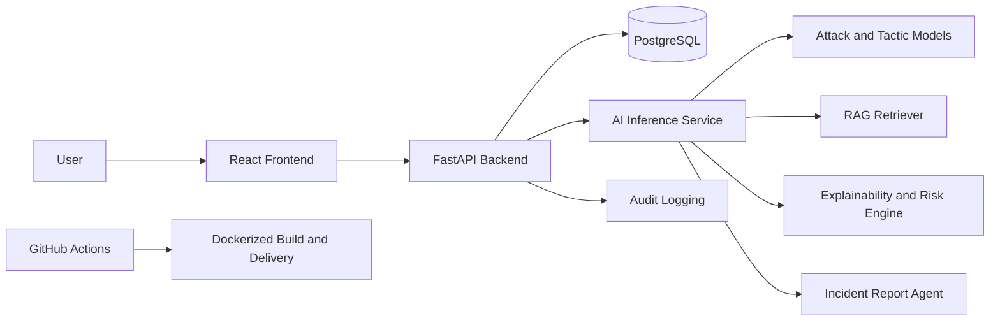

# SEER-AI++

SEER-AI++ is a full-stack cybersecurity platform for detecting and investigating social-engineering scams across email, SMS, and chat. It combines classical NLP models, a hybrid risk engine, psychological tactic detection, PostgreSQL + pgvector retrieval, SOC-style reporting, a FastAPI backend, and a React dashboard.

## Overview

The project started as an AI prototype for scam detection and was refactored into a production-style application:

- Backend: FastAPI, SQLAlchemy, Alembic, JWT auth
- Frontend: React, Vite, Tailwind CSS
- Database: PostgreSQL
- Vector retrieval: PostgreSQL + pgvector
- Deployment: Docker Compose for local use and single-host EC2 deployment
- AI core: preserved in `src/`

The platform accepts suspicious text, classifies likely attack type and persuasion tactic, computes a hybrid risk score, retrieves supporting knowledge-base evidence, and generates an analyst-style incident response summary.

## Core Features

- User registration, login, and protected API access
- Message analysis for phishing, impersonation, financial fraud, credential harvesting, and related categories
- Psychological tactic detection such as urgency, authority, fear, secrecy, and reward
- Hybrid risk scoring from model confidence, rules, and RAG evidence
- PostgreSQL persistence for users, analyses, triggered rules, retrieved chunks, reports, audit logs, and KB vectors
- Knowledge-base retrieval using pgvector similarity search
- React investigation dashboard for history, details, and reports
- Dockerized local and EC2-ready deployment paths

## Architecture



## High-Level Flow

1. A user submits a suspicious message through the frontend or API.
2. The backend calls the AI inference pipeline in `backend/app/ai/inference_pipeline.py`.
3. The risk engine in `src/risk_engine.py` performs:
   - attack prediction
   - tactic prediction
   - rule-based scoring
   - RAG retrieval from PostgreSQL + pgvector
4. Explainability and agent modules generate plain-English reasoning and an incident report.
5. The backend stores the analysis, retrieved chunks, triggered rules, and report in PostgreSQL.
6. The frontend renders the result and preserves it in user history.

## Repository Structure

```text
seer_ai_pp/
├── backend/
│   ├── app/
│   │   ├── ai/
│   │   ├── controllers/
│   │   ├── core/
│   │   ├── models/
│   │   ├── repositories/
│   │   ├── schemas/
│   │   ├── services/
│   │   └── main.py
│   ├── alembic/
│   ├── tests/
│   ├── requirements.txt
│   ├── Dockerfile
│   ├── .env.example
│   └── .env.production.example
├── frontend/
│   ├── src/
│   ├── Dockerfile
│   ├── package.json
│   ├── .env.example
│   └── .env.production.example
├── deploy/
├── data/
├── outputs/
├── src/
├── docker-compose.yml
├── docker-compose.prod.yml
└── README.md
```

## AI and RAG Modules Reused

The refactor preserved the original AI core in `src/`:

- `src/risk_engine.py`
- `src/explainability.py`
- `src/rag/`
- `src/agents/`

The main RAG change is that KB chunks and embeddings are now stored in PostgreSQL using pgvector instead of FAISS files. This keeps structured and semantic retrieval data in one database and simplifies deployment.

## pgvector Migration Summary

The RAG layer now uses:

- `knowledge_chunks` table in PostgreSQL
- pgvector `vector` extension
- vector similarity search with cosine distance
- KB indexing from `src/rag/build_index.py`
- retrieval from `src/rag/retriever.py`

The retriever still returns the same shape used by the rest of the app:

- `retrieved_chunks`
- `relevance_scores`
- `synthesized_explanation`

For lightweight tests and local non-Postgres smoke runs, the retriever includes a small SQLite-compatible fallback path.

## API Summary

Auth:

- `POST /api/auth/register`
- `POST /api/auth/login`
- `GET /api/auth/me`

Analysis:

- `POST /api/analysis`
- `GET /api/analysis/{id}`
- `GET /api/analysis/history`
- `DELETE /api/analysis/{id}`

Reports:

- `POST /api/reports/{analysis_id}`
- `GET /api/reports/{id}`

Dashboard:

- `GET /api/dashboard/overview`
- `GET /api/dashboard/risk-distribution`
- `GET /api/dashboard/attack-types`
- `GET /api/dashboard/recent-analyses`

Health:

- `GET /health`

## Local Development

### Backend

```bash
cd seer_ai_pp
python3.10 -m venv .venv310
source .venv310/bin/activate
.venv310/bin/pip install -r backend/requirements.txt
cp backend/.env.example backend/.env
export PYTHONPATH=backend:.
alembic -c backend/alembic.ini upgrade head
python -m src.rag.build_index
uvicorn app.main:app --app-dir backend --reload
```

### Frontend

```bash
cd frontend
cp .env.example .env
npm install
npm run dev
```

Local URLs:

- Frontend: `http://localhost:5173`
- Backend: `http://localhost:8000`
- Health: `http://localhost:8000/health`

## Docker Development

The development Docker stack keeps frontend, backend, and PostgreSQL separate and exposed:

```bash
cd seer_ai_pp
docker compose up --build
```

Then initialize or rebuild the KB vectors:

```bash
docker compose exec backend alembic -c backend/alembic.ini upgrade head
docker compose exec backend python -m src.rag.build_index
```

Development services:

- Frontend: `http://localhost:5173`
- Backend: `http://localhost:8000`
- PostgreSQL: `localhost:5432`

The DB image is `pgvector/pgvector:pg16`.

## Production Deployment on EC2

Production uses `docker-compose.prod.yml` plus the scripts in `deploy/`:

- `deploy/ec2-setup.sh`
- `deploy/deploy.sh`
- `deploy/backup-db.sh`
- `deploy/restore-db.sh`
- `deploy/DEPLOYMENT.md`

Quick production path:

```bash
cd seer_ai_pp
cp backend/.env.production.example backend/.env.production
cp frontend/.env.production.example frontend/.env.production
bash deploy/deploy.sh
```

Production setup serves the frontend through Nginx on port `80` and proxies `/api` and `/health` to the backend container.

## Required Environment Variables

Backend:

- `APP_NAME`
- `ENVIRONMENT`
- `SECRET_KEY`
- `ALGORITHM`
- `ACCESS_TOKEN_EXPIRE_MINUTES`
- `DATABASE_URL`
- `CORS_ORIGINS`
- `UPLOADS_DIR`
- `REPORTS_DIR`
- `SEER_EMBEDDING_DIMENSION`

Production backend also uses:

- `POSTGRES_DB`
- `POSTGRES_USER`
- `POSTGRES_PASSWORD`

Frontend:

- `VITE_API_BASE_URL`
- `FRONTEND_PORT` for production compose

## Database Migrations

Run migrations locally:

```bash
cd seer_ai_pp
source .venv310/bin/activate
export PYTHONPATH=backend:.
alembic -c backend/alembic.ini upgrade head
```

Run migrations inside Docker:

```bash
docker compose exec backend alembic -c backend/alembic.ini upgrade head
```

## Rebuild the Knowledge Base Index

Local:

```bash
cd seer_ai_pp
source .venv310/bin/activate
export PYTHONPATH=backend:.
python -m src.rag.build_index
```

Docker:

```bash
docker compose exec backend python -m src.rag.build_index
```

Production Docker:

```bash
docker compose -f docker-compose.prod.yml exec -T backend python -m src.rag.build_index
```

## Tests and Validation

Backend tests:

```bash
cd seer_ai_pp
source .venv310/bin/activate
export PYTHONPATH=backend:.
pytest backend/tests tests/test_rag.py -q
```

Frontend build:

```bash
cd frontend
npm run build
```

Compose validation:

```bash
docker compose -f docker-compose.yml config
docker compose -f docker-compose.prod.yml config
```

## CI/CD

GitHub Actions live in `.github/workflows/`:

- `backend-ci.yml`
- `frontend-ci.yml`
- `docker.yml`

The Docker workflow validates both development and production Compose files and then builds the images.

## Why pgvector

pgvector was chosen because it:

- keeps relational application data and semantic retrieval in one PostgreSQL deployment
- avoids introducing a separate vector database
- fits local Docker and single-host EC2 deployment well
- keeps the system simpler for a graduation project while still looking production-oriented

## Notes

- Streamlit is no longer the main application path.
- The app remains offline-friendly through local artifacts and deterministic fallbacks.
- The backend preserves controller/service/repository separation.
- For EC2, expose only `22` and `80` publicly unless you explicitly need more.
