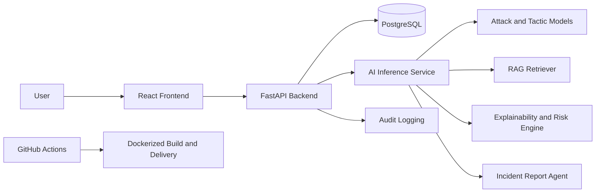

# SEER-AI++

SEER-AI++ is a full-stack digital safety assistant for everyday users. It helps people check suspicious messages, emails, links, attachments, voice notes, and images before they click, reply, share, or upload. Internally it still uses the existing FastAPI, PostgreSQL, pgvector, and AI pipeline architecture, but the product experience is now focused on simple guidance and plain-English explanations.

## Overview

The project started as an AI prototype for scam detection and was refactored into a production-style application:

- Backend: FastAPI, SQLAlchemy, Alembic, JWT auth
- Frontend: React, Vite, Tailwind CSS
- Database: PostgreSQL
- Vector retrieval: PostgreSQL + pgvector
- Deployment: Docker Compose for local use and single-host EC2 deployment
- AI core: preserved in `src/`

The platform can now help answer questions like:

- Is this message a scam?
- Is this link safe enough to open?
- Does this attachment look suspicious?
- Does this voice message sound manipulative or urgent?
- Could this image expose private information if I share it?

## Core Features

- User registration, login, and protected API access
- Hybrid text analysis with legacy classifiers plus a configurable cloud-augmented reasoning path
- Message safety checks for scam, impersonation, pressure, urgency, and manipulation signals
- Email parsing for pasted emails and `.eml` uploads, including sender, reply-to, subject, links, and attachment metadata
- Link checks with local heuristics plus connector-ready enrichment hooks
- File hash checks with format recognition and clear wording when no threat database is configured
- Voice-note checks with optional transcription, transcript analysis, and acoustic pressure scoring
- Image privacy checks using multi-pass OCR preprocessing plus sensitive-information pattern matching
- Hybrid risk scoring from model confidence, rules, retrieval evidence, and multimodal fusion
- PostgreSQL persistence for users, analyses, safety checks, triggered rules, retrieved chunks, reports, audit logs, and KB vectors
- Knowledge-base retrieval using pgvector similarity search
- Prometheus metrics, structured logs, request IDs, readiness/liveness endpoints, and Grafana dashboards
- React dashboard for consumer-friendly safety checks, history, and reports
- Dockerized local and EC2-ready deployment paths

## Architecture


```mermaid
flowchart LR
    U[User] --> F[React Frontend]
    F --> B[FastAPI Backend]
    B --> DB[(PostgreSQL)]
    B --> AI[AI Inference Service]
    AI --> M[Attack and Tactic Models]
    AI --> R[RAG Retriever]
    AI --> X[Explainability and Risk Engine]
    AI --> G[Incident Report Agent]
    B --> L[Audit Logging]
    CI[GitHub Actions] --> D[Dockerized Build and Delivery]
```

## High-Level Flow

1. A user submits a message, email, voice note, link, attachment, hash, or image through the frontend or API.
2. The backend routes the request into a feature-specific safety service.
3. Message-like content is passed into the AI inference pipeline in `backend/app/ai/inference_pipeline.py`.
3. The risk engine in `src/risk_engine.py` performs:
   - attack prediction
   - tactic prediction
   - rule-based scoring
   - RAG retrieval from PostgreSQL + pgvector
4. Feature helpers add URL, attachment, hash, transcription, or OCR-specific checks when relevant.
5. Explainability and agent modules generate plain-English reasoning and advice.
6. The backend stores the result in PostgreSQL for history and follow-up reports.
7. The frontend renders a simple result like `Safe`, `Caution`, `Risky`, or `Private info detected`.

## Repository Structure

```text
seer_ai_pp/
├── backend/
│   ├── app/
│   │   ├── ai/
│   │   ├── controllers/
│   │   ├── core/
│   │   ├── models/
│   │   ├── repositories/
│   │   ├── schemas/
│   │   ├── services/
│   │   └── main.py
│   ├── alembic/
│   ├── tests/
│   ├── requirements.txt
│   ├── Dockerfile
│   ├── .env.example
│   └── .env.production.example
├── frontend/
│   ├── src/
│   ├── Dockerfile
│   ├── package.json
│   ├── .env.example
│   └── .env.production.example
├── deploy/
├── data/
├── outputs/
├── src/
├── docker-compose.yml
├── docker-compose.prod.yml
└── README.md
```

## AI and RAG Modules Reused

The refactor preserved the original AI core in `src/`:

- `src/risk_engine.py`
- `src/explainability.py`
- `src/rag/`
- `src/agents/`

The main RAG change is that KB chunks and embeddings are now stored in PostgreSQL using pgvector instead of FAISS files. This keeps structured and semantic retrieval data in one database and simplifies deployment.

## pgvector Migration Summary

The RAG layer now uses:

- `knowledge_chunks` table in PostgreSQL
- pgvector `vector` extension
- vector similarity search with cosine distance
- KB indexing from `src/rag/build_index.py`
- retrieval from `src/rag/retriever.py`

The retriever still returns the same shape used by the rest of the app:

- `retrieved_chunks`
- `relevance_scores`
- `synthesized_explanation`

For lightweight tests and local non-Postgres smoke runs, the retriever includes a small SQLite-compatible fallback path.

## API Summary

Auth:

- `POST /api/auth/register`
- `POST /api/auth/login`
- `GET /api/auth/me`

Analysis:

- `POST /api/analysis`
- `GET /api/analysis/{id}`
- `GET /api/analysis/history`
- `DELETE /api/analysis/{id}`

Reports:

- `POST /api/reports/{analysis_id}`
- `GET /api/reports/{id}`

Dashboard:

- `GET /api/dashboard/overview`
- `GET /api/dashboard/risk-distribution`
- `GET /api/dashboard/attack-types`
- `GET /api/dashboard/recent-analyses`

Health:

- `GET /health`
- `GET /health/live`
- `GET /health/ready`
- `GET /metrics`

Safety checks:

- `POST /api/safety/message`
- `POST /api/safety/voice`
- `POST /api/safety/email`
- `POST /api/safety/email-upload`
- `POST /api/safety/attachment`
- `POST /api/safety/link`
- `POST /api/safety/hash`
- `POST /api/safety/image-privacy`
- `GET /api/safety/history`
- `GET /api/safety/{id}`
- `POST /api/safety/webhook`

## Local Development

### Backend

```bash
cd seer_ai_pp
python3.10 -m venv .venv310
source .venv310/bin/activate
.venv310/bin/pip install -r backend/requirements.txt
cp backend/.env.example backend/.env
export PYTHONPATH=backend:.
alembic -c backend/alembic.ini upgrade head
python -m src.rag.build_index
uvicorn app.main:app --app-dir backend --reload
```

### Lightweight Local Backend

For a normal development machine, the fastest non-Docker path is the lightweight backend mode:

```bash
cd seer_ai_pp
python3 -m venv .venv-local
.venv-local/bin/pip install -r backend/requirements-local.txt
cp backend/.env.local.example backend/.env
./scripts/run_backend.sh
```

This mode uses:

- SQLite instead of PostgreSQL
- `ENABLE_RAG=false`
- `ENABLE_OCR=false`
- `ENABLE_MONITORING=false`
- `ENABLE_HEAVY_MODELS=false`

The backend still boots and supports the app flow, but optional heavyweight features are degraded gracefully instead of blocking startup.

### Full Local Backend

If you want the intended full local backend path with PostgreSQL, pgvector, OCR, and monitoring enabled:

```bash
cd seer_ai_pp
cp backend/.env.example backend/.env
.venv310/bin/pip install -r backend/requirements.txt
./scripts/init_local_postgres.sh
./scripts/run_backend_full.sh
```

Prerequisites for this full local path:

- PostgreSQL running locally
- `pgvector` extension available in that PostgreSQL instance
- Tesseract OCR installed on the host
- optional OpenAI API key if you want OpenAI-backed generation/transcription

Suggested macOS/Homebrew setup if PostgreSQL is not installed yet:

```bash
brew install postgresql@16 pgvector
brew services start postgresql@16
export PATH="/opt/homebrew/opt/postgresql@16/bin:$PATH"
```

### Frontend

```bash
cd frontend
cp .env.example .env
npm install
npm run dev
```

Local URLs:

- Frontend: `http://localhost:5173`
- Backend: `http://localhost:8000`
- Health: `http://localhost:8000/health`
- Docs: `http://localhost:8000/docs`

## Local Docker Quick Start

The local Docker stack runs PostgreSQL with pgvector, the FastAPI backend, and the Vite frontend.

Required env files:

- None for the default Docker flow.
- Optional: copy `backend/.env.example` to `backend/.env` and `frontend/.env.example` to `frontend/.env` if you also want host-native runs outside Docker.

Optional feature configuration:

- `WEBHOOK_SECRET`
  Use this if you want to accept external safety-check webhooks.
- `OPENAI_API_KEY`
  Optional. If provided, the backend can use OpenAI for grounded RAG explanations and voice-note transcription.
- `AUDIO_TRANSCRIPTION_MODEL`
  Defaults to `whisper-1`.
- `OPENAI_GENERATION_MODEL`
  Defaults to `gpt-4o-mini`.
- `METRICS_ENABLED`
  Enables the `/metrics` endpoint for Prometheus scraping.
- `INSTALL_AI_EXTRAS`
  Defaults to `false` for faster local Docker builds. Set it to `true` only when you want the backend image to install heavyweight local-model packages like `torch`, `transformers`, and `sentence-transformers`.

OCR support:

- Docker already installs `tesseract-ocr` for backend containers.
- For host-native backend runs, install Tesseract locally if you want OCR-based image privacy checks outside Docker.

Start the stack:

```bash
cd seer_ai_pp
docker compose up --build
```

Faster default local build behavior:

- Docker now installs the backend core runtime by default.
- Heavy local-model packages are optional so everyday local startup does not block on downloading the full transformer stack.
- If you want the heavier local-model path in Docker, run:

```bash
cd seer_ai_pp
INSTALL_AI_EXTRAS=true docker compose up --build
```

Dependency layout:

- `backend/requirements-core.txt`
  Core backend runtime and services used for normal local Docker runs.
- `backend/requirements-ai.txt`
  Optional heavyweight local-model extras used only when `INSTALL_AI_EXTRAS=true`.
- `backend/requirements.txt`
  Convenience aggregate for host-native installs that still want the full stack.

Lightweight Compose defaults:

- The default Compose backend now uses:
  - `ENABLE_RAG=false`
  - `ENABLE_OCR=false`
  - `ENABLE_MONITORING=false`
  - `ENABLE_HEAVY_MODELS=false`
- Prometheus and Grafana are now behind the optional `monitoring` profile.
- For the lightest useful laptop-friendly stack, run:

```bash
cd seer_ai_pp
docker compose up --build
```

- If you want monitoring too, run:

```bash
cd seer_ai_pp
ENABLE_MONITORING=true docker compose --profile monitoring up --build
```

- If you also want the heavyweight local-model extras in Docker, run:

```bash
cd seer_ai_pp
ENABLE_MONITORING=true ENABLE_RAG=true ENABLE_OCR=true ENABLE_HEAVY_MODELS=true INSTALL_AI_EXTRAS=true docker compose --profile monitoring up --build
```

Expected local URLs:

- Frontend: `http://localhost:5173`
- Backend: `http://localhost:8000`
- Docs: `http://localhost:8000/docs`
- Health: `http://localhost:8000/health`
- Liveness: `http://localhost:8000/health/live`
- Readiness: `http://localhost:8000/health/ready`
- Metrics: `http://localhost:8000/metrics`
- Prometheus: `http://localhost:9090`
- Grafana: `http://localhost:3000`

Consumer-facing safety tools in the app:

- `Message Check`
- `Voice Check`
- `Link Check`
- `Image Privacy Check`
- `History`

Webhook usage:

- Endpoint: `POST /api/safety/webhook`
- Header: `X-SEER-Webhook-Secret: <your secret>`
- Supported payload fields:
  - `message`
  - `email_text`
  - `url`

Important limitations:

- Attachment checks are metadata-based only. They do not run full malware sandboxing.
- Link checks use local heuristics and do not guarantee a link is safe.
- Hash checks validate the hash format and can explain limits, but they do not query a live threat database by default.
- Image privacy checks rely on OCR and pattern matching, so they may miss text or flag partial matches.
- Voice-note analysis is strongest when transcription is available and the file is a clean WAV recording. Other formats may fall back to transcript-led analysis.

## Architecture Notes

Detailed architecture notes live in:

- `docs/architecture/multimodal-platform.md`

That document covers:

- current architecture
- target multimodal architecture
- pipeline design
- monitoring design
- model/fallback tradeoffs

## Monitoring And Observability

The local platform now includes:

- Prometheus scraping the backend `/metrics` endpoint
- Grafana with a preprovisioned SEER-AI dashboard
- structured JSON logs with request IDs
- per-request latency and throughput metrics
- model latency metrics
- retrieval quality proxy metrics
- OpenAI token usage counters
- fallback/degraded-mode counters
- process CPU and memory gauges

Default Grafana login:

- username: `admin`
- password: `admin`

## Clean Local Reset

Use the helper scripts when you want a reproducible local cleanup before rebuilding the stack.

Soft cleanup:

- `./scripts/clean_local.sh`
- removes repo-local Python caches, pytest cache, frontend `dist`, frontend `node_modules`, and local SQLite test DBs
- keeps Docker volumes and PostgreSQL data

Soft Docker reset:

- `./scripts/docker_reset.sh`
- equivalent to `docker compose down --remove-orphans`
- removes only this project's containers and network
- preserves `postgres_data` and `frontend_node_modules`

Full Docker reset:

- `./scripts/docker_reset_full.sh`
- equivalent to `docker compose down --remove-orphans -v`
- removes this project's containers, network, and named volumes
- deletes PostgreSQL data in `postgres_data`
- deletes the Docker-managed `frontend_node_modules` volume

Fresh Docker start:

```bash
./scripts/clean_local.sh
./scripts/docker_reset.sh
docker compose up --build
```

If you want a true from-scratch database boot, replace `./scripts/docker_reset.sh` with `./scripts/docker_reset_full.sh`.

What happens on backend startup:

- waits for PostgreSQL to become reachable
- runs `alembic upgrade head`
- creates the pgvector extension through the migration flow
- builds the knowledge-base index if `knowledge_chunks` is empty

Local URLs:

- Frontend: `http://localhost:5173`
- Backend: `http://localhost:8000`
- Backend docs: `http://localhost:8000/docs`
- Health: `http://localhost:8000/health`

Useful commands:

```bash
./scripts/clean_local.sh
./scripts/docker_reset.sh
./scripts/docker_reset_full.sh
docker compose logs -f
docker compose logs -f backend
docker compose exec backend alembic -c backend/alembic.ini upgrade head
docker compose exec backend python -m src.rag.build_index
docker compose down
docker compose down -v
docker compose up --build
```

The DB image is `pgvector/pgvector:pg16`, and PostgreSQL data is persisted in the `postgres_data` volume.

## Production Deployment on EC2

Production uses `docker-compose.prod.yml` plus the scripts in `deploy/`:

- `deploy/ec2-setup.sh`
- `deploy/deploy.sh`
- `deploy/backup-db.sh`
- `deploy/restore-db.sh`
- `deploy/DEPLOYMENT.md`

Quick production path:

```bash
cd seer_ai_pp
cp backend/.env.production.example backend/.env.production
cp frontend/.env.production.example frontend/.env.production
bash deploy/deploy.sh
```

Production setup serves the frontend through Nginx on port `80` and proxies `/api` and `/health` to the backend container.

## Required Environment Variables

Backend:

- `APP_NAME`
- `ENVIRONMENT`
- `SECRET_KEY`
- `ALGORITHM`
- `ACCESS_TOKEN_EXPIRE_MINUTES`
- `DATABASE_URL`
- `CORS_ORIGINS`
- `UPLOADS_DIR`
- `REPORTS_DIR`
- `SEER_EMBEDDING_DIMENSION`

Production backend also uses:

- `POSTGRES_DB`
- `POSTGRES_USER`
- `POSTGRES_PASSWORD`

Frontend:

- `VITE_API_BASE_URL`
- `FRONTEND_PORT` for production compose

## Database Migrations

Run migrations locally:

```bash
cd seer_ai_pp
source .venv310/bin/activate
export PYTHONPATH=backend:.
alembic -c backend/alembic.ini upgrade head
```

Run migrations inside Docker:

```bash
docker compose exec backend alembic -c backend/alembic.ini upgrade head
```

## Rebuild the Knowledge Base Index

Local:

```bash
cd seer_ai_pp
source .venv310/bin/activate
export PYTHONPATH=backend:.
python -m src.rag.build_index
```

Docker:

```bash
docker compose exec backend python -m src.rag.build_index
```

Production Docker:

```bash
docker compose -f docker-compose.prod.yml exec -T backend python -m src.rag.build_index
```

## Tests and Validation

Backend tests:

```bash
cd seer_ai_pp
source .venv310/bin/activate
export PYTHONPATH=backend:.
pytest backend/tests tests/test_rag.py -q
```

Frontend build:

```bash
cd frontend
npm run build
```

Compose validation:

```bash
docker compose -f docker-compose.yml config
docker compose -f docker-compose.prod.yml config
```

## CI/CD

GitHub Actions live in `.github/workflows/`:

- `backend-ci.yml`
- `frontend-ci.yml`
- `docker.yml`

The Docker workflow validates both development and production Compose files and then builds the images.

## Why pgvector

pgvector was chosen because it:

- keeps relational application data and semantic retrieval in one PostgreSQL deployment
- avoids introducing a separate vector database
- fits local Docker and single-host EC2 deployment well
- keeps the system simpler for a graduation project while still looking production-oriented

## Notes

- Streamlit is no longer the main application path.
- The app remains offline-friendly through local artifacts and deterministic fallbacks.
- The backend preserves controller/service/repository separation.
- For EC2, expose only `22` and `80` publicly unless you explicitly need more.
