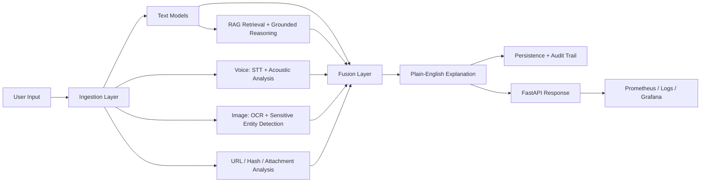

# SEER-AI Multimodal Platform Architecture

## Current architecture

Before this upgrade, SEER-AI already had:

- FastAPI backend with auth, analysis, reports, and history
- PostgreSQL with pgvector-backed knowledge retrieval
- classical TF-IDF + Logistic Regression risk models in `src/`
- OCR via `pytesseract`
- safety services for voice, URL, email, attachment, and hash checks
- Docker Compose local runtime

The main limitations were:

- the backend AI runtime was a thin wrapper around the legacy risk engine
- observability was limited to basic health checks and audit logs
- multimodal evidence was handled mostly in separate services
- retrieval was useful but not a full grounded reasoning layer
- fallback behavior was present but not instrumented

## Target architecture

The upgraded design keeps the current stack but introduces a more explicit AI platform structure:

- `ingestion`
  - parse and normalize text, email, URLs, attachments, hashes, audio, images
- `model inference`
  - configurable text and generation providers
  - transcript analysis
  - acoustic signal analysis
  - OCR with preprocessing
- `retrieval + reasoning`
  - pgvector retrieval
  - grounded explanation generation
  - citations
- `multimodal fusion`
  - weighted evidence fusion
  - confidence and degraded-mode handling
- `explanation`
  - plain-language explanation and recommendation
- `persistence`
  - existing `analyses` plus `safety_scans`
- `monitoring`
  - Prometheus metrics
  - structured logs
  - request IDs
  - readiness / liveness
  - Grafana dashboards

## Multimodal pipeline

## Monitoring design

The platform now exposes:

- `/health/live`
- `/health/ready`
- `/metrics`

Tracked signals include:

- per-endpoint request count and latency
- model inference latency
- retrieval quality proxy via top retrieval score
- confidence distribution
- risk-score distribution
- OpenAI token usage and estimated cost
- degraded-mode / fallback counters
- process CPU and memory

Structured logging adds:

- request IDs
- latency
- path and status
- error events

## Model choices and tradeoffs

- Text:
  - current upgrade uses a configurable hybrid runtime
  - local path reuses the existing risk engine and tactic heuristics
  - OpenAI can augment classification and reasoning when configured
  - this is production-practical now, while remaining extensible for a future local transformer classifier

- Retrieval:
  - pgvector remains the vector store
  - retrieval synthesis is now grounded and citation-oriented
  - OpenAI generation is optional, not mandatory

- OCR:
  - still uses Tesseract by default
  - now adds multi-pass preprocessing and confidence-aware selection
  - architecture remains open for a future PaddleOCR or docTR provider

- Voice:
  - combines transcript analysis with heuristic acoustic signal features
  - works best on clean WAV input
  - leaves room for a future paralinguistic model without changing endpoint shape

## Known limitations

- The strongest text path still depends on OpenAI for the cloud-augmented mode.
- Acoustic analysis is currently heuristic rather than a dedicated pretrained paralinguistic model.
- OCR is stronger than before but still depends on image quality.
- URL and hash enrichment are connector-ready, but still local-only by default.
